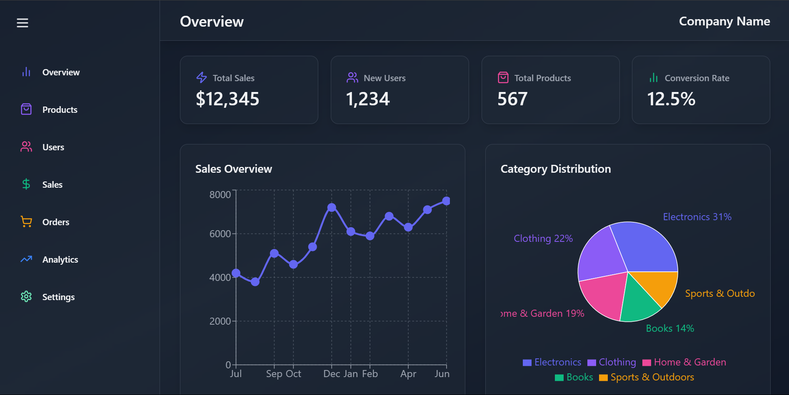
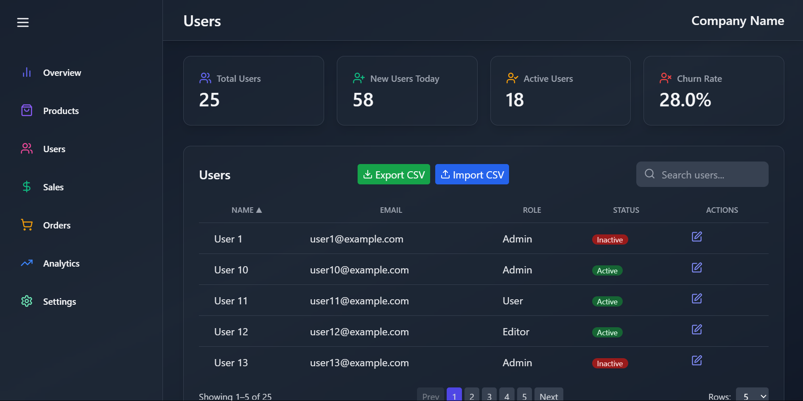
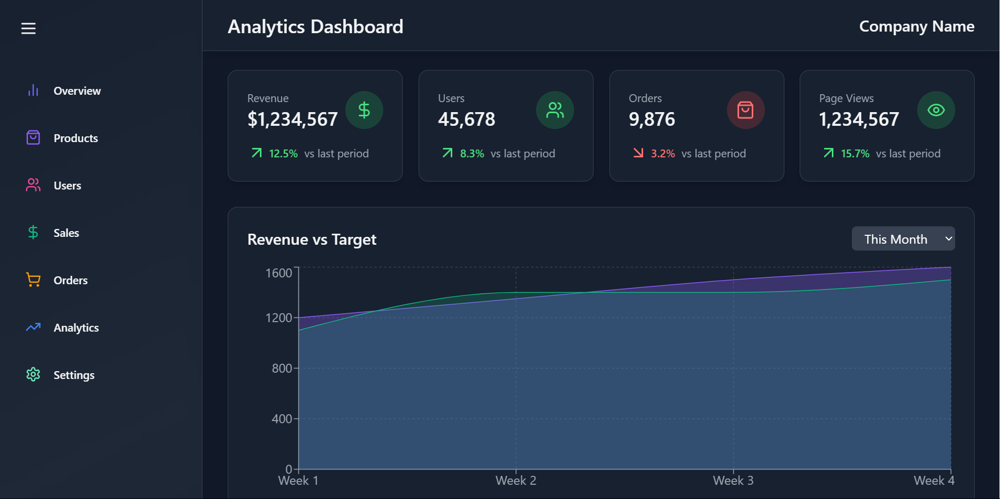

# React Admin Dashboard

A modern, responsive admin dashboard built with **React**, **Vite**, and **Tailwind CSS**. This dashboard provides a comprehensive overview of business metrics, analytics, sales, orders, products, users, and settings, featuring interactive charts and a clean UI.

## Table of Contents

-   [Features](#features)
-   [Tech Stack](#tech-stack)
-   [Getting Started](#getting-started)
-   [Usage Example](#usage-example)
-   [Project Structure](#project-structure)
-   [Customization](#customization)
-   [Contribution Guidelines](#contribution-guidelines)
-   [License](#license)

## Features

-   **Overview Dashboard**: Key business stats and visualizations at a glance.
-   **Products Management**: View product stats, trends, and inventory.
-   **Users Management**: User growth, activity heatmaps, and demographics.
-   **Sales Analytics**: Revenue, order value, conversion rates, and trends.
-   **Orders Tracking**: Order stats, daily trends, and distribution.
-   **Advanced Analytics**: Revenue, channel performance, retention, segmentation, and AI-powered insights.
-   **Settings**: Profile, notifications, security, connected accounts, and danger zone.
-   **Responsive Design**: Optimized for all devices.
-   **Modern Stack**: React 18, Vite, Tailwind CSS, Framer Motion, Recharts, and more.

## Tech Stack

-   **Frontend**: React, React Router, Tailwind CSS, Framer Motion, Lucide Icons, Recharts
-   **Build Tool**: Vite
-   **Linting**: ESLint
-   **Other Libraries**: xlsx, file-saver, react-icons

## Getting Started

### Prerequisites

-   Node.js (v18+ recommended)
-   npm or yarn

### Installation

```bash
npm install
# or
yarn install
```

### Development

Start the development server:

```bash
npm run dev
# or
yarn dev
```

Open [http://localhost:5173](http://localhost:5173) to view the app.

### Build

To build for production:

```bash
npm run build
# or
yarn build
```

### Preview Production Build

```bash
npm run preview
# or
yarn preview
```

### Lint

```bash
npm run lint
# or
yarn lint
```

## Screenshot





## Usage Example

Here's how you can add a new stat card to the Overview page:

```jsx
import StatCard from "../components/common/StatCard";
import { Star } from "lucide-react";

<StatCard
    name="New Feature"
    icon={Star}
    value="123"
    color="#FFD700"
    redirect={"/new-feature"}
/>;
```

## Project Structure

-   `src/Pages/`: Main dashboard pages (Overview, Products, Users, Sales, Orders, Analytics, Settings)
-   `src/components/`: Reusable UI components, charts, and widgets
-   `src/data/`: Mock data for analytics, sales, products, users, and orders
-   `public/`: Static assets

## Customization

-   **Styling**: Tailwind CSS is used for rapid UI development and easy customization.
-   **Routing**: Managed with React Router.
-   **Charts**: Built with Recharts for interactive data visualization.

## Contribution Guidelines

Contributions are welcome! To contribute:

1. Fork this repository.
2. Create a new branch: `git checkout -b feature/your-feature-name`
3. Make your changes and commit them: `git commit -m 'Add some feature'`
4. Push to your fork: `git push origin feature/your-feature-name`
5. Open a pull request describing your changes.

Please ensure your code follows the existing style and passes linting (`npm run lint`).

## License

This project is licensed under the MIT License.
